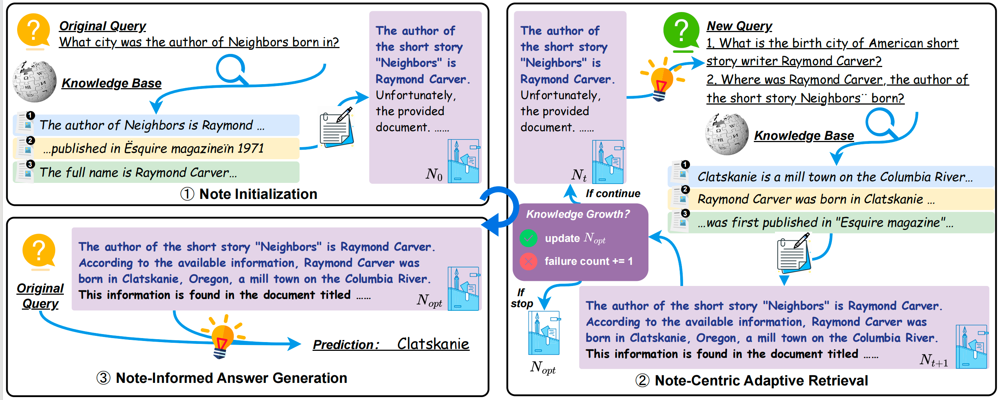

<h1 align="center">
    DeepNote: Note-Centric Deep Retrieval-Augmented Generation
</h1>


We develop **DeepNote**, an adaptive RAG framework that achieves in-depth
and robust exploration of knowledge sources through note-centric adaptive retrieval. DeepNote employs notes as carriers for refining and accumulating knowledge. During in-depth exploration, it uses these notes to determine retrieval timing, formulate retrieval queries, and iteratively assess knowledge growth, ultimately leveraging the best note for answer generation.



# Prepare Datasets

All corpus and evaluation files should be placed in the `/data` directory. You can download the experimental data [here](https://drive.google.com/drive/folders/1NeEm-r7l43MQxGS1n7jJ8tPvltgcaPjY?usp=sharing).

We use Wikipedia as the corpus for ASQA and StrategyQA. Due to its large size, please download it separately [here](https://dl.fbaipublicfiles.com/dpr/wikipedia_split/psgs_w100.tsv.gz) and place it in `/data/corpus/wiki/`.

# Retrieval Settings

For different datasets, we employ various retrieval methods:

For 2WikiMQA, MusiQue, and HotpotQA:
- BM25 retrieval based on ElasticSearch
- Dense retrieval with FAISS index using embeddings from BGE model

For ASQA and StrategyQA:
- Dense retrieval with FAISS index using embeddings from GTR model

## Setup ElasticSearch

Install Elasticsearch:
```bash
wget https://artifacts.elastic.co/downloads/elasticsearch/elasticsearch-7.10.2-linux-x86_64.tar.gz
wget https://artifacts.elastic.co/downloads/elasticsearch/elasticsearch-7.10.2-linux-x86_64.tar.gz.sha512
shasum -a 512 -c elasticsearch-7.10.2-linux-x86_64.tar.gz.sha512
tar -xzf elasticsearch-7.10.2-linux-x86_64.tar.gz
cd elasticsearch-7.10.2/
./bin/elasticsearch # Start the server
pkill -f elasticsearch # To stop the server
```

## Build Indices 

### For BM25
```bash
cd src/build_index/es

# 2WikiMQA
python index_2wiki.py

# MusiQue
python index_musique.py

# HotpotQA
python index_hotpotqa.py
```

### For Dense Retrieval

#### For HotpotQA, 2WikiMQA, and MusiQue
```bash
cd src/build_index/emb
python index.py --dataset hotpotqa --model bge-base-en-v1.5 # e.g., for HotpotQA dataset
```

#### For ASQA and StrategyQA
Since generating GTR embeddings for Wikipedia corpus is time-consuming, you can download the pre-computed GTR embeddings and place them in `data/corpus/wiki/`:
```bash
wget https://huggingface.co/datasets/princeton-nlp/gtr-t5-xxl-wikipedia-psgs_w100-index/resolve/main/gtr_wikipedia_index.pkl
```

Then build FAISS index:
```bash
cd src/build_index/emb
python index.py --dataset asqa --model gtr-t5-xxl
```

# Configuration

You can configure your API key, URL, and other settings in the `./config/config.yaml` file.


# Training DeepNote

The training process consists of three main steps:

## 1. Generate Training Data
Generate the initial training data using LLaMA model:
```bash
python gen_dpo_data.py \
    --model llama-3.1-8b-instruct \
    --batch_size 9 \
    --output_path ../data/dpo_data \
    --device 0,1,2,3
```

## 2. Data Selection
Filter and process the generated data:
```bash
python select_dpo_data.py \
    --output_path ../data/dpo/processed/train.jsonl \
    --init_num 1900 \
    --refine_num 1900 \
    --query_num 1900
```

## 3. Start Training
Launch the training process:
```bash
bash train.sh
```


# Running DeepNote and Evaluation

```bash
python main.py --method deepnote --retrieve_top_k 5 --dataset hotpotqa --max_step 3 --max_fail_step 2 --MaxClients 5 --model gpt-4o-mini-2024-07-18 --device cuda:0 
```
The predicted results and evaluation metrics will be automatically saved in the `output/{dataset}/` directory. The evaluation results can be found at the end of the file.
